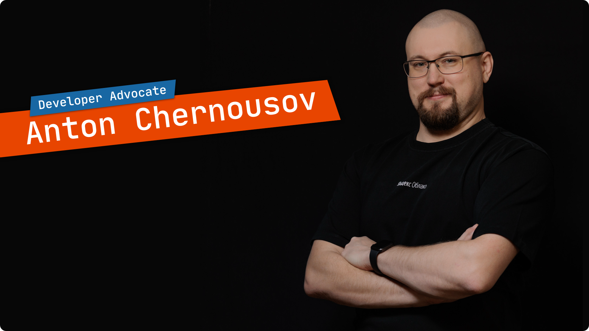

== Hello!

Thank you for stopping by.
My name is Anton (I also go by golodnyj) Chernousov.

I'm a Developer Advocate at https://https://cloud.yandex.com[Yandex Cloud].
Yandex Cloud is full-fledged cloud platform providing scalable infrastructure, storage, machine learning and development tools to build and enhance digital services and applications.

What I do?
A few things:

* I occasionally make https://t.me/taoplive[Telegram]
* I publish articles on https://habr.com/ru/users/golodnyj/posts/[Habr]
* I make some vids and livestream on https://www.youtube.com/c/AntonChernousov[Youtube].
* I produce a podcast https://pod.link/1046278525[The Art Of Programming].
* And, obviously, push some code to https://github.com/golodnyj[Github]

You can follow me on https://twitter.com/golodnyj[🐦 Twitter] and https://instagram.com/golodnyj[🖼 Instagram], where I post about my life, food, open source, and, of course, Podcasts!

++++

  
  

++++
